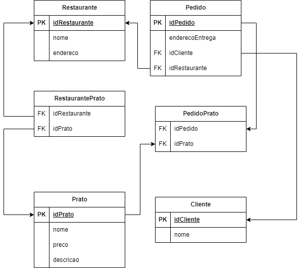

# Exercício: Sistema de Pedidos de Restaurantes

### Objetivo:
Desenvolver um sistema de pedidos para restaurantes e utilize os princípios  
de Orientação a Objetos pratique a organização de código em pacotes, classes e métodos.

### Requisitos Funcionais:
- #### Cadastrar Restaurante:
  O sistema deve permitir o cadastro de restaurantes. 
  Cada restaurante deve ter um nome, endereço e uma lista de pratos disponíveis. 
- #### Listar Restaurantes:
  Os usuários devem ser capazes de ver uma lista de todos os restaurantes cadastrados no sistema. 
- #### Adicionar Prato:
  O sistema deve permitir que os restaurantes adicionem pratos ao seu menu. 
  Cada prato deve ter um nome, preço e descrição. 
- #### Listar Pratos de um Restaurante:
  Os usuários devem ser capazes de ver a lista de pratos disponíveis de um restaurante selecionado. 
- #### Fazer um Pedido:
  Os usuários devem ser capazes de fazer um pedido selecionando um restaurante 
  escolhendo os pratos desejados e fornecendo um endereço de entrega. 
- #### Listar pedidos de um restaurante:
  Os restaurantes devem conseguir listar todos os pedidos recebidos 
- #### Ver Pedidos de um Cliente:
  Os usuários devem ser capazes de ver uma lista de todos os seus pedidos anteriores. 

### Instruções:
- #### Organização do código:
  Seu código deve estar bem organizado em pacotes, classes e métodos.  
  Por exemplo, você pode ter pacotes separados para modelos (como Restaurante, Prato e Pedido),  
  serviços (lógicas relacionadas a pedidos e restaurantes) e  
  visualização (interface do usuário e menus). 
- #### Orientação a Objetos:
  Aproveite os conceitos de OO, como encapsulamento, herança (se necessário). 
  Priorize a reutilização de código e a modularidade. 
- #### Interface do Usuário:
  Desenvolva um menu interativo simples no console 
  como o fornecido anteriormente para que os usuários possam interagir com o sistema. 
- #### Armazenamento:
  Para simplificar, os dados podem ser armazenados em estruturas 
  de dados em memória (como listas ou mapas) ao invés de um banco de dados. 
  
### Dicas:
- Comece modelando as classes principais (Restaurante, Prato, Pedido) e suas relações.
- Em seguida, concentre-se em implementar a lógica principal, como adicionar restaurantes,  
  pratos e fazer pedidos.
- Finalmente, implemente a interface do usuário para interagir com o sistema.

---
